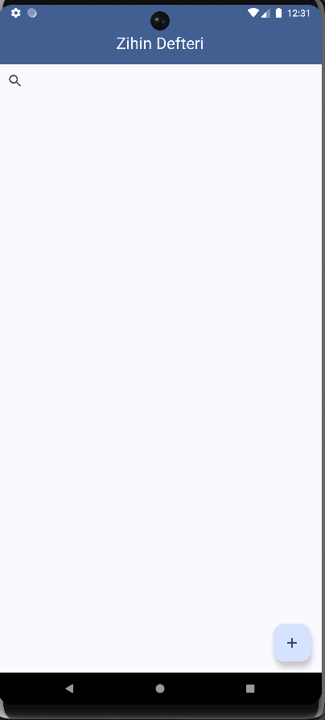
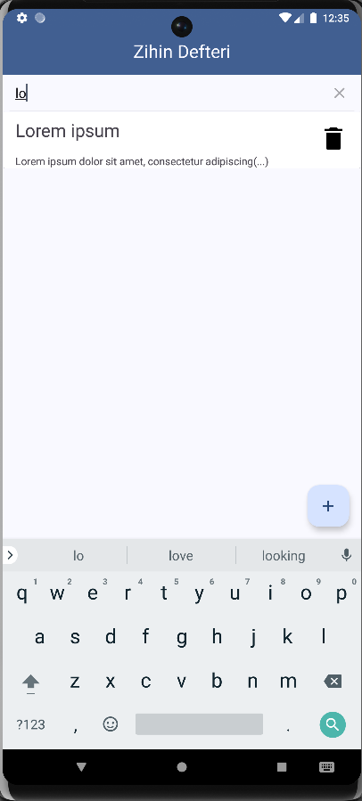
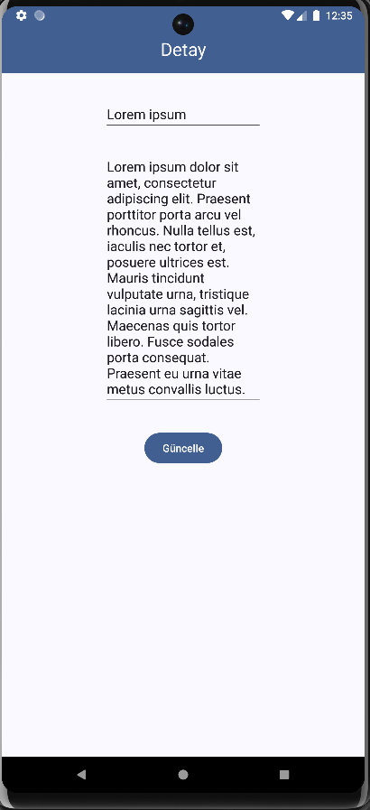
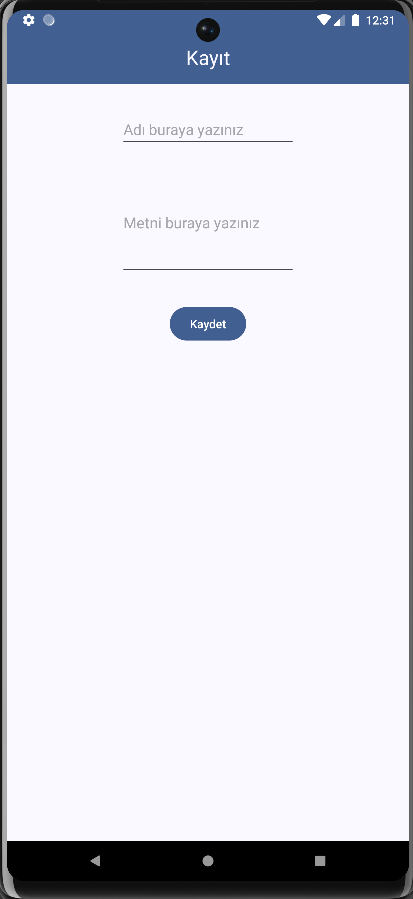

# Zihin Defteri

Zihin Defteri, kişisel notlarınızı ve görevlerinizi kolayca yönetebileceğiniz basit ama işlevsel bir **to-do uygulamasıdır**. Uygulama, kullanıcı dostu arayüzüyle not ekleme, düzenleme, silme ve arama işlemlerini hızlıca yapmanıza olanak tanır.
<p align="center">
  
  
  
  
</p>


## Özellikler

- 📌 **Anasayfa**  
  Uygulama açıldığında daha önce eklediğiniz notlar listelenir. Her kayıt kart biçiminde görünür.

- ➕ **Kayıt Ekleme**  
  Anasayfadaki **+ (artı) butonuna** basıldığında yeni not ekleme ekranı açılır.  
  Burada:
  - Notun başlığını
  - Notun içeriğini  
  girebilir ve **Kaydet** butonuna basarak veritabanına ekleyebilirsiniz. Kaydın ardından anasayfaya dönersiniz.

- 🔍 **Arama Özelliği**  
  Anasayfada bulunan arama butonu ile:
  - Not başlığına göre
  - Not içeriğine göre  
  filtreleme yapabilirsiniz.

- 🗑️ **Kayıt Silme**  
  Anasayfada listelenen her notun yanında bir silme butonu yer alır.  
  Silme butonuna bastığınızda:
  - Ekranın altında bir **Snackbar** görünür.
  - **Evet** butonuna basarsanız ilgili kayıt kalıcı olarak silinir.

- ✏️ **Güncelleme**  
  Anasayfadaki bir notun üzerine tıkladığınızda güncelleme ekranı açılır.  
  Burada notun başlığını ve içeriğini değiştirip **Güncelle** butonuna basarak düzenleyebilirsiniz. İşlem sonrası tekrar anasayfaya yönlendirilirsiniz.

- 🌙 **Tema Desteği**  
  Uygulama hem **açık tema** hem de **koyu tema** desteğine sahiptir.

---

## Kullanılan Teknolojiler

- Room Database
- RecyclerView & Adapter
- MutableLiveData
- Fragment & Navigation Component
- ViewModel
- Hilt (Dependency Injection)
- Singleton Design Pattern
- Kotlin Extensions
- Material Design - Koyu/Açık Tema

---

## Kurulum

Uygulamayı çalıştırmak için aşağıdaki adımları takip edebilirsiniz:

1. Bu projeyi klonlayın:
   ```bash
   git clone https://github.com/Software-Guardians/ZihinDefteriApp.git
   ```

2. Android Studio ile projeyi açın.

3. Gerekli bağımlılıkların yüklendiğinden emin olun (Gradle build işlemi).

4. Uygulamayı emülatörde veya fiziksel bir cihazda çalıştırabilirsiniz.

### 📦 Release (APK)

APK dosyasını doğrudan indirip kurmak isterseniz, aşağıdaki bağlantıyı kullanabilirsiniz:

👉 [Zihin Defteri v1.0 APK](https://github.com/Software-Guardians/ZihinDefteriApp/releases/download/v1.0/toDoAppByEmrullahEnisCetinkaya.apk)

---

## Lisans

Bu proje açık kaynaklıdır ve `LICENSE` dosyasında belirtilen koşullar altında lisanslanmıştır.

---
